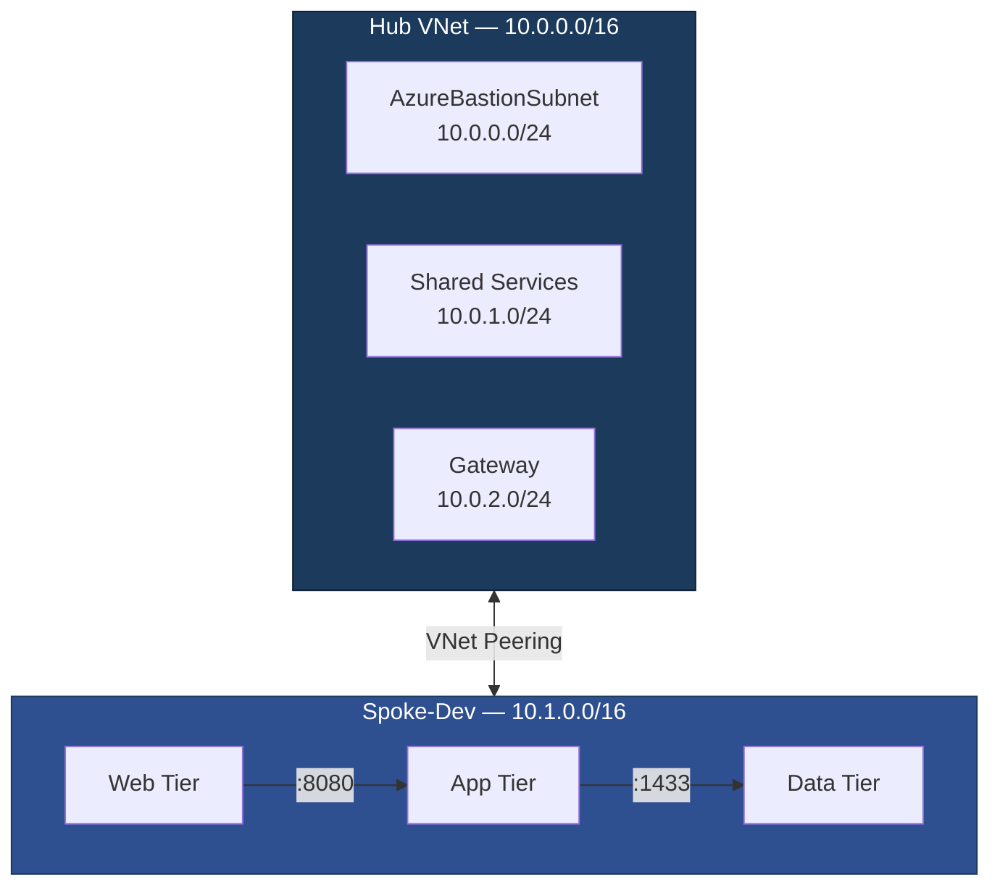

# Azure Landing Zone with Bicep

[](https://learn.microsoft.com/en-us/azure/azure-resource-manager/bicep/)
[](LICENSE)

A production-grade, multi-environment Azure Landing Zone built entirely with Bicep Infrastructure-as-Code. Implements the [Microsoft Cloud Adoption Framework](https://learn.microsoft.com/en-us/azure/cloud-adoption-framework/) hub-spoke network topology with governance policies, centralized monitoring, and secure secrets management.

---

## Architecture



## Features

- **Hub-Spoke Networking** — Centralized shared services with isolated environment spokes
- **NSG Zero-Trust** — Deny-all-inbound default with explicit allow rules per tier
- **Key Vault with RBAC** — Azure RBAC authorization (not legacy access policies)
- **Centralized Monitoring** — Log Analytics workspace with daily ingestion cap for cost control
- **Azure Policy Governance** — Naming convention and required tag enforcement
- **Multi-Environment** — Parameterized for Dev, QA, and Prod with environment-specific configs
- **Cost-Optimized** — Designed to run under $15/month in a PAYG subscription

## Repository Structure

```
├── modules/
│   ├── networking/        # VNet, NSG, Peering
│   ├── security/          # Key Vault
│   ├── monitoring/        # Log Analytics
│   ├── governance/        # Azure Policies (naming, tagging)
│   └── storage/           # Storage Account
├── environments/
│   ├── dev/               # Dev orchestrator + params
│   ├── qa/                # QA orchestrator + params
│   └── prod/              # Prod orchestrator + params
├── docs/
│   ├── architecture-decision-record.md
│   ├── naming-conventions.md
│   └── network-diagram.md
├── scripts/
│   ├── deploy.ps1         # Deployment helper
│   └── teardown.ps1       # Cleanup for cost control
├── bicepconfig.json       # Linter rules
└── README.md
```

## Prerequisites

| Tool | Version | Install |
|------|---------|---------|
| Azure CLI | 2.60+ | `winget install Microsoft.AzureCLI` |
| Bicep CLI | Latest (auto-installed) | `az bicep install` |
| VS Code + Bicep Extension | Latest | `code --install-extension ms-azuretools.vscode-bicep` |
| Git | Latest | `winget install Git.Git` |

## Quick Start

```bash
# 1. Clone
git clone https://github.com/YOUR_USERNAME/azure-landing-zone-bicep.git
cd azure-landing-zone-bicep

# 2. Login to Azure
az login
az account set --subscription "<your-subscription-id>"

# 3. Preview changes (always do this first)
./scripts/deploy.ps1 -Environment dev -WhatIf

# 4. Deploy
./scripts/deploy.ps1 -Environment dev

# 5. Verify
az group list --query "[?starts_with(name,'rg-dev-eus-landing')]" -o table

# 6. Teardown when done (save costs)
./scripts/teardown.ps1 -Environment dev
```

## Naming Convention

All resources follow the pattern: `{type}-{env}-{region}-{workload}-{instance}`

| Resource | Example |
|----------|---------|
| Resource Group | `rg-dev-eus-landing-network-001` |
| Virtual Network | `vnet-dev-eus-landing-hub-001` |
| Subnet | `snet-dev-eus-landing-web-001` |
| Key Vault | `kv-dev-eus-lz-001` |
| Storage Account | `stdeveusdiag001` |

See [docs/naming-conventions.md](docs/naming-conventions.md) for the complete reference.

## Architecture Decisions

Key design choices are documented as ADRs in [docs/architecture-decision-record.md](docs/architecture-decision-record.md):

| ADR | Decision |
|-----|----------|
| 001 | Bicep over Terraform (native Azure integration, no state management) |
| 002 | Hub-Spoke over Flat VNet (isolation, scalability, CAF alignment) |
| 003 | Key Vault RBAC over Access Policies (unified model, PIM support) |
| 004 | Single Subscription with RG Isolation (cost-optimized for learning) |
| 005 | Audit-First Policy Rollout (safe governance adoption) |
| 006 | Centralized Log Analytics with Daily Cap (cost control) |
| 007 | Environment-Differentiated Soft Delete (dev cleanup vs. prod safety) |

## Cost

| Environment | Estimated Monthly Cost | Notes |
|-------------|----------------------|-------|
| Dev | $0–2 | VNets free. Key Vault ~$0.03/10K ops. Log Analytics 5GB/month free. |
| QA | $0–2 | Same as Dev. Deploy only when needed. |
| Prod | $2–5 | Higher retention, GRS storage, more monitoring. |

**Budget alert:** Configured at $15/month with notifications at 65%, 87%, and 97% thresholds.

## Part of the Cloud Architect Mastery Roadmap

This is **Project 1** of a 10-project roadmap building toward Cloud Solutions Architect expertise. The Landing Zone serves as the infrastructure foundation for all subsequent projects:

- **Project 2:** Microservices on AKS (deploys into spoke-dev web + app subnets)
- **Project 3:** CI/CD Pipeline Governance (automates this repo's deployments)
- **Project 4:** Medallion Data Lake (uses spoke-dev data subnet)
- **Project 5:** Production RAG Application (deploys into AKS + AI Search)
- **Project 7:** Enterprise Integration Platform (Logic Apps + APIM in spoke)

## License

[MIT](LICENSE)
