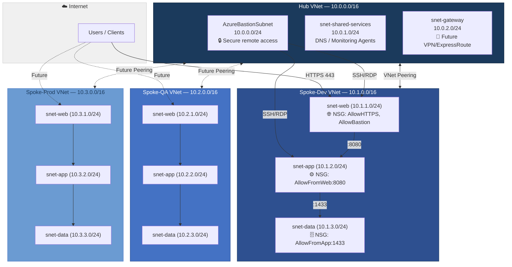
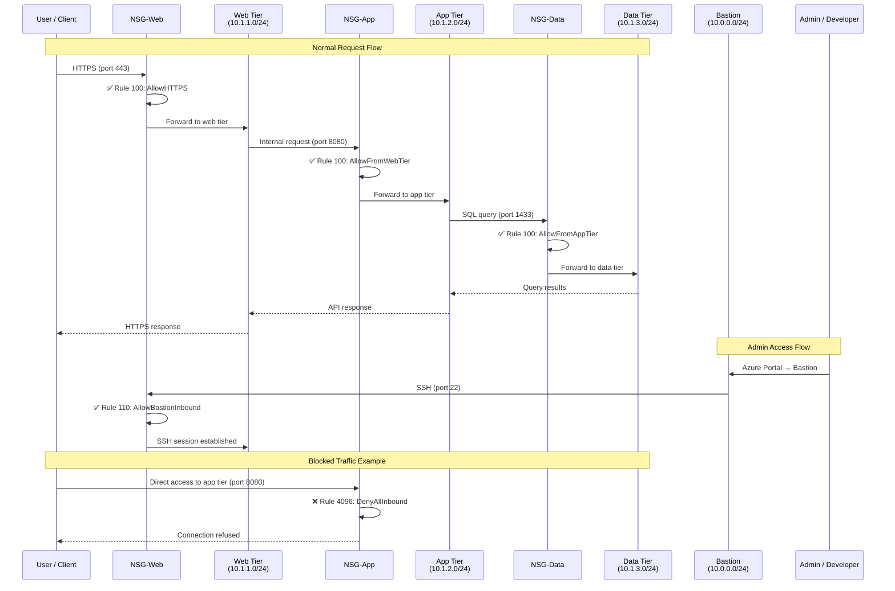
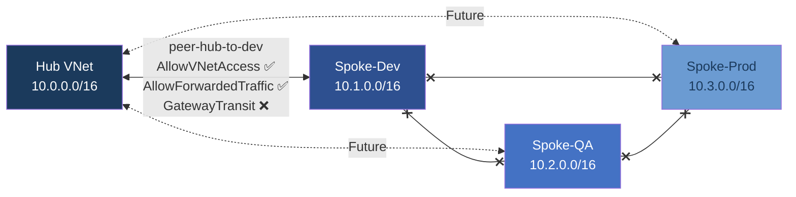

# Network Architecture Diagram

> Hub-Spoke topology for the Azure Landing Zone. This diagram renders natively on GitHub using [Mermaid](https://mermaid.js.org/).

---

## High-Level Topology

---

## Traffic Flow — Dev Environment

---

## CIDR Allocation Table

| VNet / Subnet | CIDR Block | Usable IPs | Purpose | NSG |
|---------------|-----------|------------|---------|-----|
| **Hub VNet** | **10.0.0.0/16** | **65,531** | **Shared services** | — |
| └ AzureBastionSubnet | 10.0.0.0/24 | 251 | Bastion host (fixed name) | Azure-managed |
| └ snet-shared-services | 10.0.1.0/24 | 251 | DNS forwarders, monitoring | Minimal |
| └ snet-gateway | 10.0.2.0/24 | 251 | Future VPN/ExpressRoute | Minimal |
| **Spoke-Dev VNet** | **10.1.0.0/16** | **65,531** | **Dev workloads** | — |
| └ snet-web | 10.1.1.0/24 | 251 | Web tier (AKS, App Services) | nsg-web |
| └ snet-app | 10.1.2.0/24 | 251 | App tier (Functions, APIs) | nsg-app |
| └ snet-data | 10.1.3.0/24 | 251 | Data tier (SQL, Cosmos) | nsg-data |
| **Spoke-QA VNet** | **10.2.0.0/16** | **65,531** | **QA workloads** | — |
| └ snet-web | 10.2.1.0/24 | 251 | Web tier | nsg-web |
| └ snet-app | 10.2.2.0/24 | 251 | App tier | nsg-app |
| └ snet-data | 10.2.3.0/24 | 251 | Data tier | nsg-data |
| **Spoke-Prod VNet** | **10.3.0.0/16** | **65,531** | **Prod workloads** | — |
| └ snet-web | 10.3.1.0/24 | 251 | Web tier | nsg-web |
| └ snet-app | 10.3.2.0/24 | 251 | App tier | nsg-app |
| └ snet-data | 10.3.3.0/24 | 251 | Data tier | nsg-data |

**Total address space used:** 10.0.0.0/14 (covers 10.0.0.0 through 10.3.255.255)  
**Reserved for future spokes:** 10.4.0.0/16 through 10.255.0.0/16 (252 additional spokes possible)

---

## NSG Rules Summary

### nsg-web (Web Tier)

| Priority | Name | Direction | Access | Protocol | Source | Dest Port | Description |
|----------|------|-----------|--------|----------|--------|-----------|-------------|
| 100 | AllowHTTPS | Inbound | Allow | TCP | * | 443 | Internet HTTPS traffic |
| 110 | AllowBastionInbound | Inbound | Allow | TCP | 10.0.0.0/24 | 22, 3389 | SSH/RDP from Bastion only |
| 4096 | DenyAllInbound | Inbound | Deny | * | * | * | Deny everything else |

### nsg-app (App Tier)

| Priority | Name | Direction | Access | Protocol | Source | Dest Port | Description |
|----------|------|-----------|--------|----------|--------|-----------|-------------|
| 100 | AllowFromWebTier | Inbound | Allow | TCP | 10.1.1.0/24 | 8080 | API traffic from web tier |
| 4096 | DenyAllInbound | Inbound | Deny | * | * | * | Deny everything else |

### nsg-data (Data Tier)

| Priority | Name | Direction | Access | Protocol | Source | Dest Port | Description |
|----------|------|-----------|--------|----------|--------|-----------|-------------|
| 100 | AllowFromAppTier | Inbound | Allow | TCP | 10.1.2.0/24 | 1433 | SQL from app tier |
| 4096 | DenyAllInbound | Inbound | Deny | * | * | * | Deny everything else |

---

## Peering Relationships

**Key design point:** Spokes cannot communicate with each other directly. All inter-spoke traffic must route through the Hub. This provides centralized security inspection and prevents lateral movement between environments.

---

## Future Enhancements

| Enhancement | When | Cost Impact | Description |
|-------------|------|-------------|-------------|
| Azure Bastion Host | Project 2 (AKS) | ~$0.19/hr (use Basic SKU) | Deploy only when SSH access needed, delete after |
| Azure Firewall | Prod deployment | ~$1.25/hr (skip in dev) | Centralized egress filtering in hub |
| VPN Gateway | Client connectivity | ~$0.04/hr (VpnGw1) | Connect on-prem to hub |
| Private DNS Zones | Project 5 (RAG) | Free (< 25 zones) | Private endpoint DNS resolution |
| NSG Flow Logs | Phase 3 | ~$0.50/GB | Network traffic analytics |
| Azure DDoS Protection | Production only | ~$2,944/mo | Only for internet-facing production workloads |
